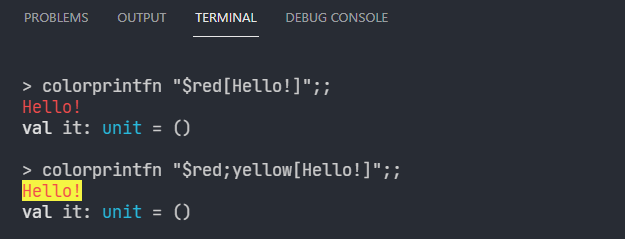
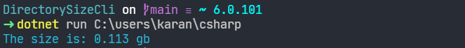
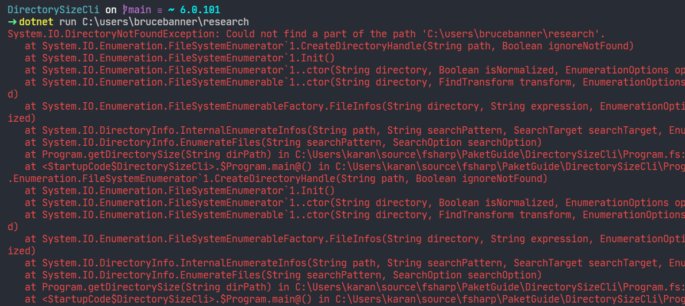

## Table of Contents

```toc

```

<br/>

F# has a great dependency management tool called Paket.
It's easy to setup and use, whether you're working with F# projects or F# scripts.

In this blog post, we'll create a solution, and project from the ground up
using Paket for dependency management. We'll then convert our F# cli app into a `.fsx` script.

You can find the completed code at this repository:
https://github.com/karanveersp/paket-guide

<br/>

# Paket Overview

Paket is a dependency management tool similar to `npm` in node, and `pip` in python.
It can be used to reference `NuGet` packages, files on GitHub, or any HTTP accessible file.

With a few cli commands (outlined below), you can easily add and update dependencies for your
F# project. While dependencies for F# projects are easy enough to manage using NuGet and IDE features,
managing dependencies for F# scripts is challenging.

That's where I feel Paket really shines, and streamlines the process of acquiring and consuming libraries
from `.fsx` scripts.

You can find the official docs here: https://fsprojects.github.io/Paket/

<br/>

# Initializing a Project

We are going to create a solution and a project to compute and display the size of a given directory in gigabytes.
It's a simple enough program which doesn't really need any external libraries to write.

However, I found a nice library we can use to output colorful text using `printfn`.

The library is located here: https://www.nuget.org/packages/BlackFox.ColoredPrintf/

Basically, we'll output the result in one color, and any errors in red.

The following steps are pretty generic which can be referenced for initializing any Paket-based project.

1. Create a new directory and initialize a solution.

   ```
   mkdir PaketGuide
   cd PaketGuide
   dotnet new sln
   ```

2. Install Paket as a local tool.

   ```
   dotnet new tool-manifest
   dotnet tool install paket
   dotnet tool restore
   ```

3. Initialize Paket. This generates a file that will contain references to our dependencies.

   ```
   dotnet paket init
   ```

4. Initialize a git repository, and create a `.gitignore` file with the following entries.

   ```
   git init
   ```

   ```.gitignore
   # Paket
   .paket/
   paket-files/
   ```

5. Create a F# console project and include it in the solution.

   ```
   dotnet new console -lang F# -o DirectorySizeCli
   dotnet sln add --project DirectorySizeCli\DirectorySizeCli.fsproj
   ```

<br/>

# Paket Files

There are three important files to be aware of to use Paket.

- `paket.dependencies` - Specifies dependencies and versions for entire codebase. Resides in _solution root_ (same level as `.sln` file).
- `paket.references` - Specifies a subset of dependencies for a project in a solution. Resides in _project root_ (same level as `.fsproj` file).
- `paket.lock` - A lock file generated by Paket. It contains all the versions of all transitive dependencies which can be used to get reproducible builds.

The `paket.dependencies` and `paket.references` files can be manually edited.
The `paket.lock` file should be left alone and only edited by Paket.

These three files should be committed into source control.

<br/>

# Commands Cheat Sheet

The following table summarizes the most important commands.

| Command                                                 | Description                                                                                                                                                                   |
| ------------------------------------------------------- | ----------------------------------------------------------------------------------------------------------------------------------------------------------------------------- |
| `dotnet paket install`                                  | Run after updating `paket.dependencies` file with new package references. Updates lock file, and refreshes all projects that specify paket dependencies to import references. |
| `dotnet paket update`                                   | Updates references to latest versions of all dependent packages.                                                                                                              |
| `dotnet paket restore`                                  | Takes current `paket.lock` file and updates all projects to reference correction versions of NuGet packages. Should be called by your build script.                           |
| `dotnet paket outdated`                                 | List dependencies that have updates.                                                                                                                                          |
| `dotnet paket generate-load-scripts --framework net6.0` | This command is used to generate _include scripts_ which can be loaded in `.fsx` files or F# interactive.                                                                     |

<br/>

# Directory Size App

We're going to write a simple app to print the size of a given directory.

```fsharp
open System
open System.IO
open System.Linq

/// Converts bytes to gigabytes
let toGb numBytes = (float numBytes) * 1e-9

/// Returns the size of a directory in gigabytes.
let getDirectorySize dirPath =
    DirectoryInfo(dirPath)
        .EnumerateFiles("*", SearchOption.AllDirectories)
        .Sum(fun fi -> fi.Length)
    |> toGb

let dirPath = Environment.GetCommandLineArgs().[1]

try
    dirPath
    |> getDirectorySize
    |> sprintf "The size is: %.3f gb"
    |> printfn "%s"
with
| :? DirectoryNotFoundException as ex -> printfn $"{ex}{ex.StackTrace}"
```

The two functions at the start do our heavy lifting.
We create a simple pipelne from the command line argument to print the directory size.

A `try...with` block is added to detect invalid directories. If the provided directory isn't found,
the exception and stack trace are printed.

It's a useful app but a bit boring! Some color ought to spice it up.

Lets use Paket to add the following dependencies to our project.

```
dotnet paket add BlackFox.ColoredPrintf --version 1.0.5
dotnet paket add FSharp.Core --version 6.0.1
```

This will add an entries to the `paket.dependencies` and `paket.references` files.

You can remove the extra frameworks if you'd like to keep things minimalistic.
The `paket.dependencies` file should look like this.

```
source https://api.nuget.org/v3/index.json

storage: none
framework: net6.0
nuget BlackFox.ColoredPrintf 1.0.5
nuget FSharp.Core 6.0.1
```

Run `dotnet restore` inside your `DirectorySizeCli` project directory.
We're ready to dive into some color!

Lets create a new `.fs` file for our `Console` module.

If you're using VSCode with the ionide extension as I am, then you can use it to add a new file above `Program.fs`.

The `ColoredPrintf` library allows specifying the foreground and background colors using a very concise syntax.

```fsharp
colorprintfn "$red[Hello!]"
```

The above function will print a red `Hello!` in the terminal. If you want to change the background, it can be included with a semicolon.

```fsharp
colorprintfn "$red;yellow[Hello!]"
```

It produces output like the following.



We want some functions that will take a string and output a string in some conventional color that corresponds to the type of message. Include this in `Console.fs`.

```fsharp
module Console

open BlackFox.ColoredPrintf

let complete = colorprintfn "$magenta[%s]"
let ok = colorprintfn "$green[%s]"
let info = colorprintfn "$cyan[%s]"
let warn = colorprintfn "$yellow[%s]"
let error = colorprintfn "$red[%s]"
```

Back in `Program.fs`, open the new `Console` module, and replace the `printfn` function with the `Console` counterparts.

```fsharp
open Console

//...

try
    dirPath
    |> getDirectorySize
    |> sprintf "The size is: %.3f gb"
    |> Console.info
with
| :? DirectoryNotFoundException as ex -> Console.error $"{ex}{ex.StackTrace}"
```

Run the code using a directory of your choosing as a command line argument.

```
dotnet run C:\users\karan\csharp
```

Now that cyan looks sweet!



Lets run a test for the exception case. What a glorious wall of red...



<br/>

# Dependencies in Scripts

Managing dependencies for F# and C# projects is straightforward using the above commands.
But what if you write some F# scripts (`.fsx` files) which need to use external packages?
Those can be directly invoked using `dotnet fsi myscript.fsx` and are often sufficient
for simple tasks that don't need the full project structure.

Paket offers a command to generate F# and C# _include scripts_ that
reference installed packages. These _include scripts_ can be used in
F# Interactive (FSI) or `.fsx` files to load packages.

When the `dotnet paket generate-load-scripts` command is run, it creates `.fsx` files under `.paket/load/`.

The generated load scripts reference DLLs from installed packages using `#r`
preprocessing directives.
Those are tedious to write, and Paket helps us out here.

The `dotnet paket generate-load-scripts` command only works after packages have been restored.
But we don't want to keep re-running this command whenever we add a new package.

To generate load scripts when installing packages, place `generate_load_scripts: true` at
the top of the `paket.dependencies` file.

```
generate_load_scripts: true
source https://api.nuget.org/v3/index.json

storage: none
framework: net6.0
nuget BlackFox.ColoredPrintf 1.0.5
nuget FSharp.Core 6.0.1
```

In a `.fsx` file you can then reference the external package.

```fsharp
#load @".paket/load/BlackFox.ColoredPrintf.fsx"

open BlackFox.ColoredPrintf
```

Lets create two files in our solution root, `Console.fsx` and `DirSize.fsx`.

Add the following into `Console.fsx`.

```fsharp
#load @".paket/load/BlackFox.ColoredPrintf.fsx"

module Console =
    open BlackFox.ColoredPrintf

    let complete = colorprintfn "$magenta[%s]"
    let ok = colorprintfn "$green[%s]"
    let info = colorprintfn "$cyan[%s]"
    let warn = colorprintfn "$yellow[%s]"
    let error = colorprintfn "$red[%s]"
```

`DirSize.fsx` loads this `Console.fsx` script. Note that our command line arg index is incremented by 1.
This is because FSI script arguments contain the fsi program itself, and the script as the first two arguments.
The command line arg is the third argument, so index `2`.

Example: `fsi script.fsx arg1 arg2...`

```fsharp
#load "Console.fsx"

open Console
open System
open System.IO
open System.Linq


/// Converts bytes to gigabytes
let toGb numBytes = (float numBytes) * 1e-9

/// Returns the size of a directory in gigabytes.
let getDirectorySize dirPath =
    DirectoryInfo(dirPath)
        .EnumerateFiles("*", SearchOption.AllDirectories)
        .Sum(fun fi -> fi.Length)
    |> toGb

let dirPath = Environment.GetCommandLineArgs().[2]

try
    dirPath
    |> getDirectorySize
    |> sprintf "The size is: %.3f gb"
    |> Console.info
with
| :? DirectoryNotFoundException as ex -> Console.error $"{ex}{ex.StackTrace}"
```

You can run the script using `dotnet fsi` to make sure the output is the same as the CLI app.

```
dotnet fsi DirSize.fsx C:\users\karan\csharp
```

<br/>

# Conclusion

We've just built a project using Paket from scratch, and used a script to load a dependency.

I know that when I got started using F# scripts, importing libraries was incredibly awkward.
Using `pip` with Python was just smoother and easier, so I just gave up. Once I discovered Paket, I was able to take my F# scripts as far as any Python script.

In this example, we've just gone through a basic example using NuGet, but I'm eager to explore the ability to reference
files on GitHub and how easy that makes sharing libraries. Great topic for a future post.

I hope that this blog post helps you become confident with using Paket and F#.

Happy scripting!
